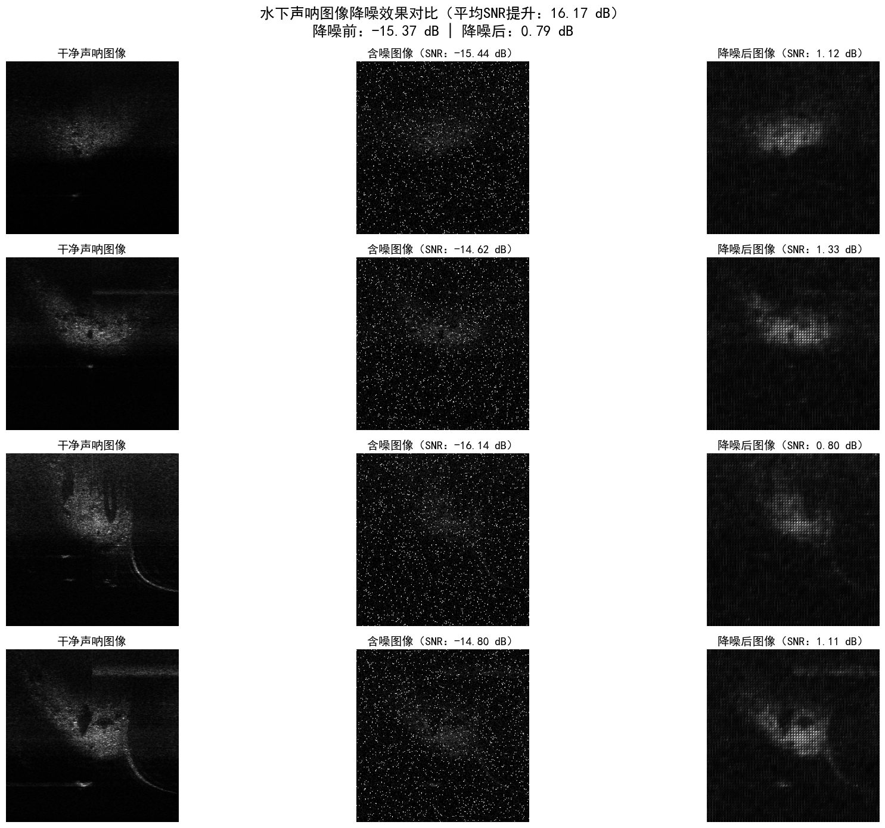
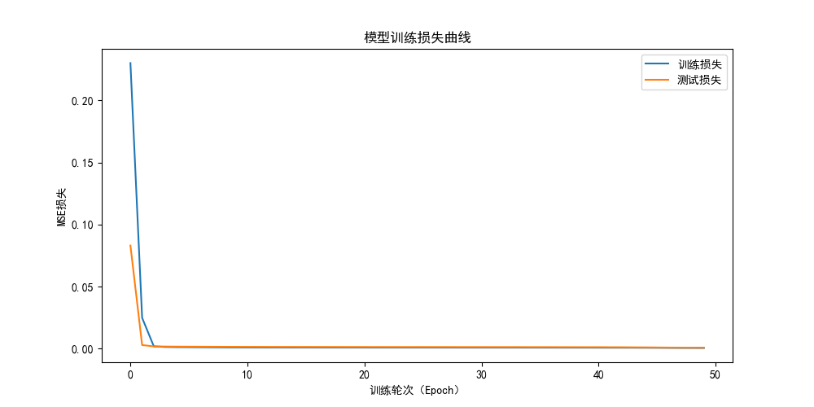

# sonar-image-denoising

Underwater sonar image denoising based on CNN autoencoder (UATD dataset)

# 水下声呐图像降噪模型（基于CNN自编码器）

## 项目简介

本项目基于UATD水下声呐数据集，使用CNN自编码器（Convolutional AutoEncoder）实现图像降噪，解决水下声呐信号受水流、电磁干扰导致的噪声问题。模型在测试集上实现了15.97 dB的SNR提升，从强噪声场景（-15.15 dB）恢复至可清晰识别目标的水平（0.82 dB）。

## 效果展示

### 降噪对比（左：干净图像，中：含噪图像，右：降噪后）



### 训练损失曲线



## 环境配置

- Python 3.10  
- 依赖库：见 `requirements.txt`  

安装命令：

```bash
pip install -r requirements.txt
```

## 训练说明

1\. 运行 `train.ipynb` 即可开始训练，默认固定随机种子（seed=42），确保结果可复现；

2\. 若需尝试不同初始化效果，可修改 `set\_seed(seed=42)` 中的 seed 数值（如 100、200）；

3\. 训练完成后，模型会保存为 `denoise\_ae.pth`，降噪效果评估见 `evaluate.ipynb`。

